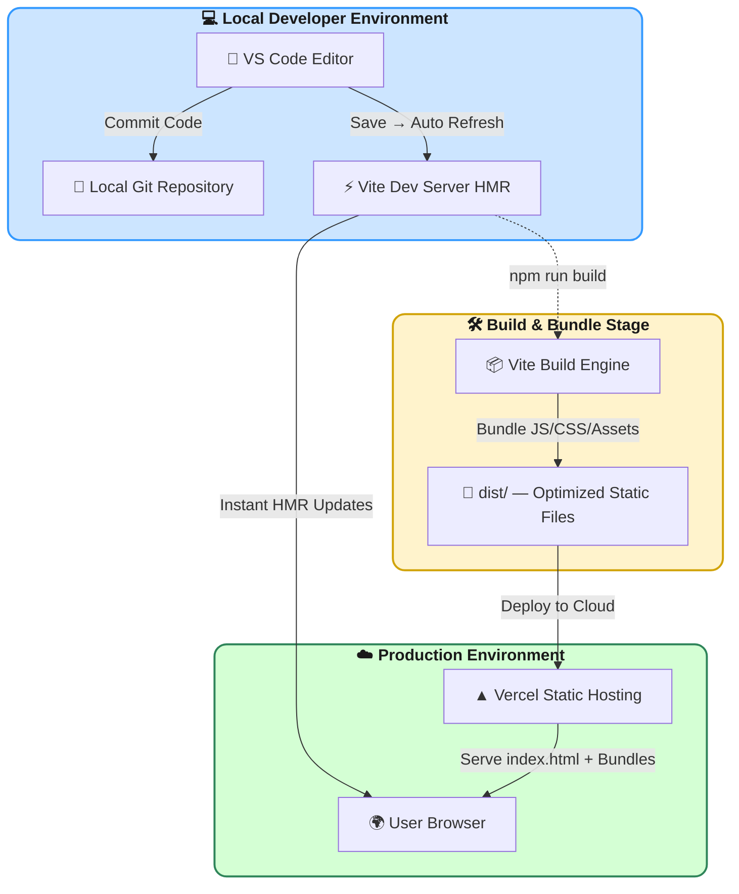

# 🎉 **Deepayan Thakur Portfolio**

<div align="center">

A modern, responsive **single-page portfolio application** built to showcase personal projects, skills, and professional experience.
## Use mouse hover on my name and see the magic 🪄
🔗 <em>[**Live Website:**](https://github.com/Deepayan-Thakur)</em>

<br>


<br>

<em> 👉 https://deepayan-thakur-portfolio.vercel.app/ 👈
</em>
</div>

---

## 📖 **Overview**

This project is a fully client-side **Single Page Application (SPA)** built with a modern toolchain, ensuring top-tier performance and effortless scalability.

### **✨ Key Features**

  **⚡ Performance:** Vite-powered development with instant HMR (Hot Module Replacement).  
  **🎨 Styling:** Tailwind CSS for a utility-first, responsive UI.  
  **🧩 Architecture:** Component-driven React structure.  
  **☁️ Deployment:** Fully static, deployed seamlessly on Vercel.

---

## 🏗 **System Architecture**

The following Mermaid diagram captures the development → build → deployment flow of the project.


---

## 📂 **Project Structure**

```
V2-final-portfolio/
└── my-portfolio/
    ├── public/              # Static assets and entry HTML
    │   ├── index.html       # SPA bootstrap file
    │   └── favicon.ico
    ├── src/
    │   ├── assets/          # Images & icons
    │   ├── components/      # Reusable React components
    │   ├── App.jsx          # Root App component
    │   ├── main.jsx         # Entry point (DOM mount)
    │   └── index.css        # Tailwind + global styles
    ├── tailwind.config.js   # Tailwind setup
    ├── postcss.config.js    # PostCSS processing
    ├── vite.config.js       # Vite build config
    ├── eslint.config.js     # ESLint rules
    └── package.json         # Dependencies & scripts
```

---

## 🛠 **Tech Stack**

| Category | Technology |
|---------|------------|
| **Core Framework** | React 18+ |
| **Build Tool** | Vite |
| **Styling** | Tailwind CSS |
| **Linting** | ESLint |
| **Package Manager** | NPM |

---

## ⚡ **Getting Started**

Run the project locally using the following steps:

### **📌 Prerequisites**
- Node.js (v14+)
- npm

---

### **📥 Installation**

#### **1️⃣ Clone the Repository**

```bash
git clone https://github.com/Deepayan-Thakur/Deepayan-Thakur-Portfolio.git
cd Deepayan-Thakur-Portfolio
```

#### **2️⃣ Navigate to Project**

```bash
cd V2-final-portfolio/my-portfolio
```

#### **3️⃣ Install Dependencies**

```bash
npm install
```

#### **4️⃣ Start Development Server**

```bash
npm run dev
```

Open the URL shown in your terminal (typically **http://localhost:5173**).

---

## 🏭 **Building for Production**

To generate an optimized production build:

```bash
npm run build
```

Output will be generated inside the `dist/` folder — ready for deployment.

---

## 📬 **Contact**

**👨‍💻 Developer:** Deepayan Thakur  
**🔗 GitHub:** [github.com/Deepayan-Thakur](https://github.com/Deepayan-Thakur)

---
